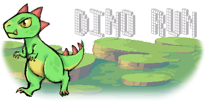

[![Contributors][contributors-shield]][contributors-url]
[![Forks][forks-shield]][forks-url]
[![Stargazers][stars-shield]][stars-url]
[![Issues][issues-shield]][issues-url]

<!-- PROJECT LOGO -->
<br />
<div align="center">

  
  <p align="center">
    Web interactive game
    <br />
    <a href="https://github.com/Kaalotaibi37/chrome-dinosaur-game/issues">Report Bug</a>
  </p>
</div>

## Overview

In this project, we built a chrome dinosaur game with a different theme and more functionalities called Dino Run. The chrome dinosaur game right now does not have lots of mechanics and only has minimal graphics. We strive to make it look better and more fun to play. The target audience for the game is all people of all ages who enjoy video games. 

This is an undergraduate computer science project for Internet Technologies CS438 at Imam Mohammad Ibn Saud Islamic University.

### Built With
- <a href="https://phaser.io/">Phaser 3</a>
- <a href="https://www.aseprite.org/">Aseprite</a>
- <a href="https://code.visualstudio.com/">VS Code</a>
- <a href="https://www.apachefriends.org/index.html">XAMPP</a>

## Getting Started 
To get a local copy up and running follow these simple steps.

### Prerequisites
local web server such as <a href="https://www.apachefriends.org/index.html">XAMPP</a> and <a href="https://www.wampserver.com/en/">WAMP</a>

### Installation
1. Clone the repository
   ```sh
   git clone https://github.com/Kaalotaibi37/chrome-dinosaur-game.git
   ```
2. Download the project as a Zip file <a href="https://github.com/Kaalotaibi37/chrome-dinosaur-game/archive/refs/heads/main.zip">here</a>.

### Running The Game
After downloading the project, add the unziped folder to your local server document_root directory. Then create a database named gameserver and import gameserver.sql table. Finally, run the folder that contains the games file from your local host.

<div align="center">
  
</div>

**For more detailed information kindly check the **<a href="https://github.com/Kaalotaibi37/chrome-dinosaur-game/wiki">Wiki</a>.

## Contributers

| Student                      |    Linkedin        |     Github      |
| :--------------------------- | :----------------: | :-------------: |
| Khalid Abdulaziz Alotaibi    | [khalidalotaibi37] | [Kaalotaibi37]  |
| Mansour Abdulaziz Alsaleh    | [mansour-alsaleh]  |    [Maas-99]    |
| Mohammad Sulaiman Alkhalifah | [mssalkhalifah-ln]    | [mssalkhalifah] |


## Acknowledgments
- <a href="https://ansimuz.itch.io/sunny-land-pixel-game-art">SunnyIsland</a>
- <a href="https://opengameart.org/content/meteor-animated-64x64">OpenGameArt</a>
- <a href="https://developer.mozilla.org/en-US/docs/Web/CSS/transform-function/skewX
">Transform Function</a>

<!-- MARKDOWN LINKS -->

[contributors-shield]: https://img.shields.io/github/contributors/Kaalotaibi37/chrome-dinosaur-game.svg?style=flat-square
[contributors-url]: https://github.com/Kaalotaibi37/chrome-dinosaur-game/graphs/contributors
[forks-shield]: https://img.shields.io/github/forks/Kaalotaibi37/chrome-dinosaur-game.svg?style=flat-square
[forks-url]: https://github.com/Kaalotaibi37/chrome-dinosaur-game/network/members
[stars-shield]: https://img.shields.io/github/stars/Kaalotaibi37/chrome-dinosaur-game.svg?style=flat-square
[stars-url]: https://github.com/Kaalotaibi37/chrome-dinosaur-game/stargazers
[issues-shield]: https://img.shields.io/github/issues/Kaalotaibi37/chrome-dinosaur-game.svg?style=flat-square
[issues-url]: https://github.com/Kaalotaibi37/chrome-dinosaur-game/issues

[kaalotaibi37]: https://github.com/Kaalotaibi37
[Maas-99]: https://github.com/Maas-99
[mssalkhalifah]: https://github.com/mssalkhalifah

[khalidalotaibi37]: https://www.linkedin.com/in/khalidalotaibi37/
[mansour-alsaleh]: https://www.linkedin.com/in/mansour-alsaleh/
[mssalkhalifah-ln]: https://www.linkedin.com/in/mssalkhalifah/


